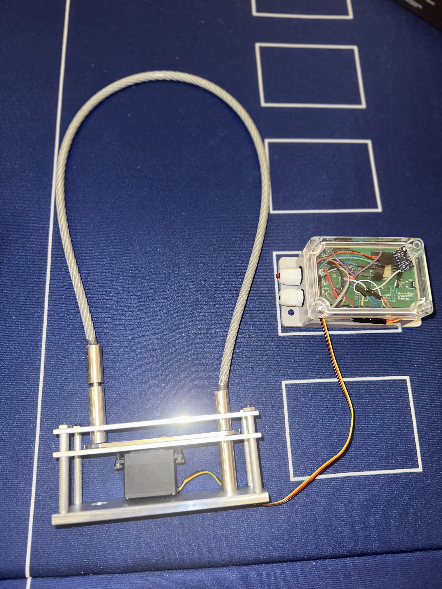

# Smart Bike Lock System (Secured Illini)

Embedded IoT system for real-time bike security, combining Bluetooth authentication, motion-based tamper detection, and cloud monitoring. Designed and built as a full-stack hardware + firmware solution with a custom PCB, power subsystem, and multi-state control architecture.

  

---

## Overview

This project addresses the limitations of traditional bike locks by introducing a multi-layered smart security system. The device enables keyless locking via Bluetooth, detects unauthorized motion using onboard sensors, and sends real-time alerts to a cloud dashboard.

The system integrates embedded firmware, wireless communication, and physical hardware design into a single cohesive product.

---

## Key Features

- Bluetooth Low Energy (BLE) locking/unlocking
- Motion-based tamper detection using IMU (MPU6050)
- Finite State Machine (LOCKED, UNLOCKED, ALARM)
- Real-time cloud monitoring via ThingSpeak
- Servo-actuated locking mechanism
- Audible alarm + LED alert system
- Custom PCB with integrated power and control subsystems
- End-to-end system from hardware to cloud

---

## System Architecture

### Hardware
- ESP32-S3 microcontroller
- MPU6050 accelerometer/gyroscope
- Servo motor (locking mechanism)
- Piezo buzzer (alarm system)
- Custom-designed PCB
- 4.8V 2000mAh battery + 3.3V regulation (LM1117)

### Software
- Embedded C++ (Arduino framework)
- BLE server with custom services and callbacks
- HTTP-based cloud communication (ThingSpeak)
- Real-time state management using FSM

---

## Finite State Machine

The system is controlled by a 3-state FSM:

- **LOCKED**
  - Default state
  - Monitors acceleration for tampering
  - Triggers ALARM when threshold exceeded

- **UNLOCKED**
  - Triggered via authenticated BLE command
  - Disables motion-based alerts

- **ALARM**
  - Triggered on suspicious motion
  - Activates buzzer + LED flashing
  - Sends periodic cloud updates until reset

State transitions are driven by both user commands and sensor input.

---

## Motion Detection Algorithm

Tampering is detected using acceleration magnitude computed from IMU data:

- Combines x, y, z acceleration using Euclidean norm
- Adjusts for gravity (~9.8 m/s²)
- Triggers alarm when threshold exceeds ~13 m/s²

This approach enables robust detection of real-world disturbances while filtering noise.

---

## Cloud Monitoring

- Data sent via HTTP POST to ThingSpeak
- Logged data includes:
  - Lock state (LOCKED / UNLOCKED / ALARM)
  - Temperature
  - Acceleration (x, y, z)

**Performance:**
- Alert latency: ~22 seconds from tamper event to dashboard update
- Continuous updates every 15 seconds during alarm state

---

## Performance & Testing

- Lock/unlock response time: ~1.5 seconds via BLE  
- Reliable motion detection using threshold-based IMU analysis  
- Real-time alert system validated through live testing  
- Estimated battery life:
  - ~2.3 days (passive)
  - Higher under optimized conditions  

---

## Engineering Challenges

- Initial PCB revisions lacked proper USB-UART connections
- Stepper motor limitations required redesign → switched to servo
- Debugging soldering and signal integrity issues under ESP32
- BLE + WiFi integration timing and reliability

---

## Solutions

- Redesigned PCB with correct USB bridge integration
- Transitioned to servo motor for precise control
- Iterative debugging and hardware refinement
- Optimized firmware for stable communication and control

---

## Future Improvements

- Mobile application for improved user experience
- GPS tracking for stolen bike recovery
- Push notifications instead of dashboard polling
- Power optimization for extended battery life
- Modular smart attachment for existing locks

---

## Team

- Sebastian Sovailescu  
- Andrew Ruiz  
- Bowen Cui  

University of Illinois Urbana-Champaign  
ECE 445 – Senior Design

---

## Summary

This project demonstrates the design and implementation of a complete embedded system integrating hardware, firmware, and cloud infrastructure. It highlights real-world engineering challenges, iterative development, and system-level thinking in building a practical IoT security device.

